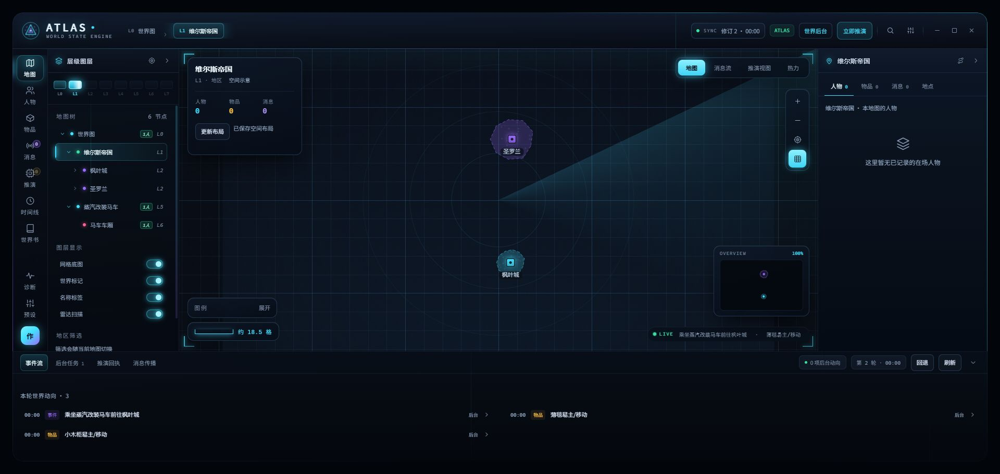
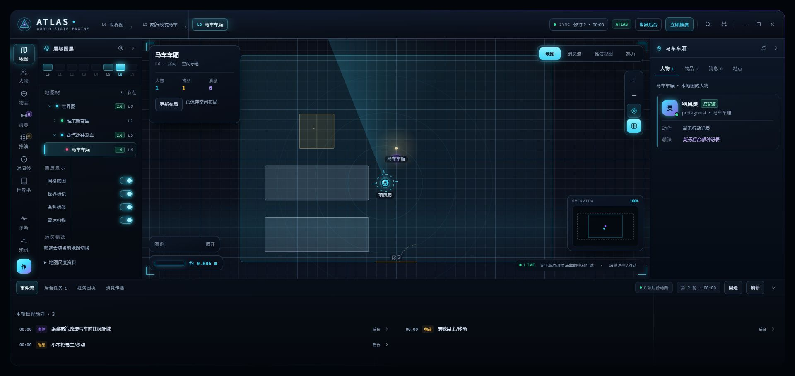

# 世界资料、自动布局与 API 页面修复

日期：2026-10-09。基线：main / 2284e1a。工作分支：codex/worldview-layout-and-api-fixes。
这是 0.9.85 基线上的本地修复，未发布新版本、未推送或合并。

## 通用修复

- 优先将世界观与地理条目纳入世界书来源预算，避免长角色传记挤掉明确地点。
- 首次建设及未完成建设使用 bootstrap 范围，先登记原文明确地点与包含关系；科技、交通和地形遵守当前资料。生产提示词不写测试角色卡或测试地名。
- 世界建设完成状态记录到焦点地点的内图，避免误记到上级世界图。
- 普通生成与建设自动安排空间布局。布局按每张图保存结构指纹，跳过完成图之后再取批次，防止后续城市一直排不到。
- 首次进入缺少布局的地图自动请求一次布局；失败有提示和手动重试入口。手动更新明确选择的地图时允许重新请求。
- 布局任务携带世界资料；旧约束中的正式实体 ID 转为本批冻结短引用，家具本图 ID 保持不变。
- 移动地点从固定地块投影中移除。移动行程使用载具图例与实际进度，停靠位置优先于离站前旧坐标；POV 隐藏停靠点不会泄露坐标。没有可用位置或路线时不伪造移动点。
- 独立房间的视野按实际房间几何适应，保持原地图尺寸、坐标和单位。柜面支持放置物品，修复 ITEM_CONTAINER_NOT_FOUND 误报。
- API 页面恢复获取模型，经酒馆 CSRF 代理读取模型列表；实测返回 26 个模型。
- 增加可选函数输出开关：自定义 OpenAI 兼容连接可声明 emit_atlas_operations，tool_choice=auto；仅接收声明的函数和 content 字符串，结果继续走原操作校验。默认关闭。酒馆主连接/Claude 格式目前不支持此开关，会明确提示。用户展示的随机函数名不写入实现。

## 验证

1. 完整串行测试：1845 / 1845 通过，0 失败、0 跳过，约 178 秒。
2. 最后补充手动更新绕过自动跳过规则后，验收回归 19 / 19 通过；TypeScript 类型检查再次通过。
3. 最终源码重新构建、打包，复制至本机 8000 酒馆已安装扩展。
4. 独立聊天 `Atlas 自动化验收 20260930 - 2026-10-09@17h03m50s032ms` 使用普通生成，保存 17 个地点；初始阶段、建设阶段、布局阶段均有 HTTP 200 回执。开启可选函数输出的请求成功，但回执未记录原始 tool_calls，不能据此确认模型实际选择了函数分支；函数参数解析与代理传递由离线回归验证。
5. 世界图与房间图在首批自动保存；地区图首次点击进入后自动保存布局，无需再点击生成布局。最终安装版本重新打开保存聊天，独立房间视野正常显示。
6. 测试连接与任务绑定已恢复。原每轮世界推演/失败组纠错使用的「酒馆连接验收 0.9.83」仍为酒馆主连接；按此前十倍超时要求从 60000 调到 600000 毫秒。初始化原连接 worldTurn 保持 1200000 毫秒。gemini 恢复原 30000 毫秒、函数输出关闭。

## 验证范围与剩余状态

- 17 个地点不等于 17 张完整布局。布局仍按两图每批生成，后续普通回合或首次进入继续补图。未知地理资料不承诺自动变成确定地形。
- 真实生成回执曾出现 TIME_UNRESOLVED：正文没有可确认的时长，世界时钟保持原值；没有编造经过时间。世界根图未标定尺度，保留 INITIAL_EXTENT_MISSING 提示。
- 初始布局回执中的柜面物品警告来自修复前布局器，历史回执保留；该问题已由柜面承载回归验证，未修改历史回执来伪造全通过。
- 真实在线模型验证覆盖本机 Chrome 和现有中转连接；移动载具路线和停靠投影另由回归测试验证，不宣称所有模型、所有角色卡均已通过。
- 正式剧情未改写；独立验收聊天保留。

## 视觉证据

首次进入自动补好的地区图：

最终安装版本的独立房间：

