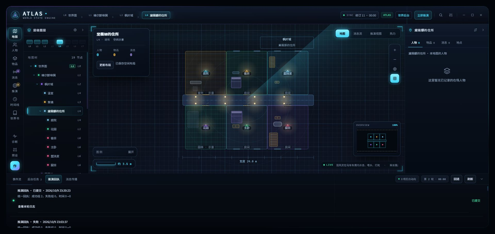

# 空间布局细节与日志修复验收（2026-10-09）

## 现场结论

检查的是本机 `localhost:8000` 的 ATLAS 插件和独立聊天「Atlas 自动化验收 20260930」，未使用旧的 10 月 7 日导出日志代替现场状态。

- 23:03:37 的住所布局回执失败：`JSON_SYNTAX`、`LAYOUT_NOT_GENERATED`、`coreSaved:false`。模型请求返回 HTTP 200，回复中的 JSON 无法解析；界面的本地失败状态不能解释为上游 API 返回 500。
- 当时住所地图没有保存 `atlasScene`，因此渲染使用地点散点。只调整颜色或放大散点不会补出房间。
- 回执详情过滤器漏掉 SQL 请求元数据，导致日志里请求记录只剩 `phase`，难以判断耗时和实际返回量。
- 原始 `atlas-ui-preview (2).html` 的楼层画面使用房间轮廓、中央走廊、门、灯光与陈设。此次修复延续该页面的渲染样式，并把已有世界空间映射为这些图元。

## 实现

1. 多空间布局任务提供能装入当前范围的房间基线；宽度按布局扫描网格对齐，覆盖已登记的全部直属空间。
2. AI 获取地点用途描述、已登记物品和世界资料，按用途组装陈设。提供合法 JSON 外层示例，避免将伪 JSON 字段说明直接复制为回复。没有针对测试角色卡写特化逻辑。
3. 房间约束增加可选 `indoor/outdoor/garden` 角色，完整通过校验、生成、合并、视角投影与 UI；庭院和花园有面积及材质，室外不生成室内窗户。
4. 在零条可解析操作、明确 JSON 语法错误且剩余请求预算足够时，自动请求一次完整格式纠错。第一次坏回复不写入；第二次仍经过原目录、修订检查和空间校验。有效部分回复不走此自动重试。
5. 已保存的窗户实际绘制；人物所在房间保留原版青色强调；走廊和灯光使用保存坐标；正式地图不再画示例中硬编码的走廊长椅。
6. 多房间地图按实际布局范围适应视野，尺寸线和图签跟随布局位置，保留物理尺度。
7. 请求记录保留状态、阶段、耗时、输出字符数、结束原因和一次纠错记录；密钥、请求正文等仍不进入回执详情。

## 本机真实模型验收

操作：部署打包后的扩展，进入未生成布局的住所地图触发自动布局；之后刷新酒馆、重新打开同一聊天和地图，核对持久化及日志。

本次 API 任务绑定为 `worldTurn`，提供商 MiniMax-M3。没有把之前的 Gemini 测试结果算作本次测试。

| 请求 | HTTP | 耗时 | 输出字符数 |
| --- | --- | --- | --- |
| layout | 200 | 47,341 ms | 13,676 |
| layout_repair | 200 | 26,022 ms | 6,901 |

首个回复语法错误，一次完整纠错成功。网关现场日志显示第二次返回由 plain channel 输出，不能据此宣称本次走了工具调用通道。

- 提交轮次：`turn_697d37d14c23f6b59a8aa94f`。
- 回执：`committed`，成功 2 组、失败 0 组，警告 `LAYOUT_RESPONSE_RETRIED`，`coreSaved:true`。
- 生成 6 个已登记空间、12 组陈设、6 个连接入口及中央走廊。空间生成校验没有错误。
- 客房和主卧有床与储物；厨房有柜架与桌台；庭院、花园使用室外角色。
- 世界分支修订 10→11，数据库存储修订 11→12。刷新后场景和日志完整保留，没有再次发起模型请求。
- 正式剧情未改动；独立测试聊天仍为原有 3 条消息。主角仍在马车，没有为展示效果搬进住所。

## 验证与交付

- `npm run typecheck` 通过。
- 新增/扩展门禁覆盖房间容量与引用、格式纠错、室外窗户规则、视角角色保留、窗户绘制、主角强调、日志脱敏及实际布局视野。
- `npm run pack` 通过，已更新本机安装扩展；安装前备份在 `.tmp/spatial-before-install-20261009`。
- 最终全量运行 1,857 项中 1,856 项通过，唯一异常是发布审计与打包测试并行：审计枚举到随后已被原子替换的 `.pack-tmp` 文件，报 ENOENT。打包结束后单独复跑发布审计 3/3 通过。空间、回执、适应视野相关用例全部通过；此结果不宣称最终并行全量运行零失败。

## 范围与限制

这仍是依据世界资料生成的估计空间示意，不是测量得到的建筑图。现有数据没有把住所的两层分别登记出来，本次显示的是六个直属空间的组合布局，不能宣称完整还原两层建筑。历史错误回执和历史重复地点没有被删除。一次自动纠错提高恢复能力，但第二次回复如果仍错误会继续拒绝发布。
