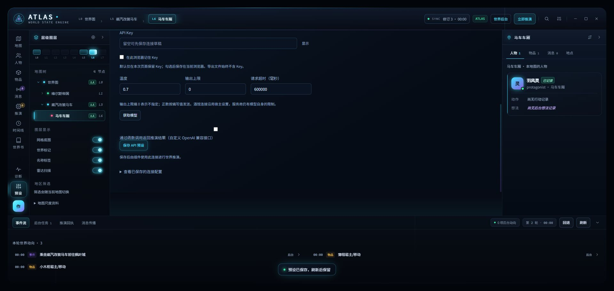
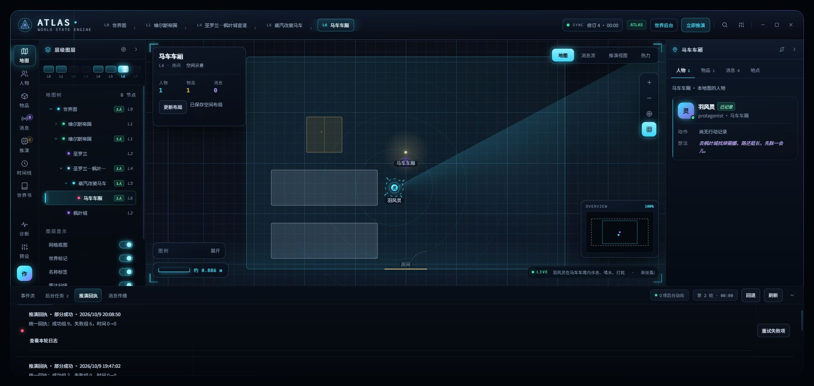
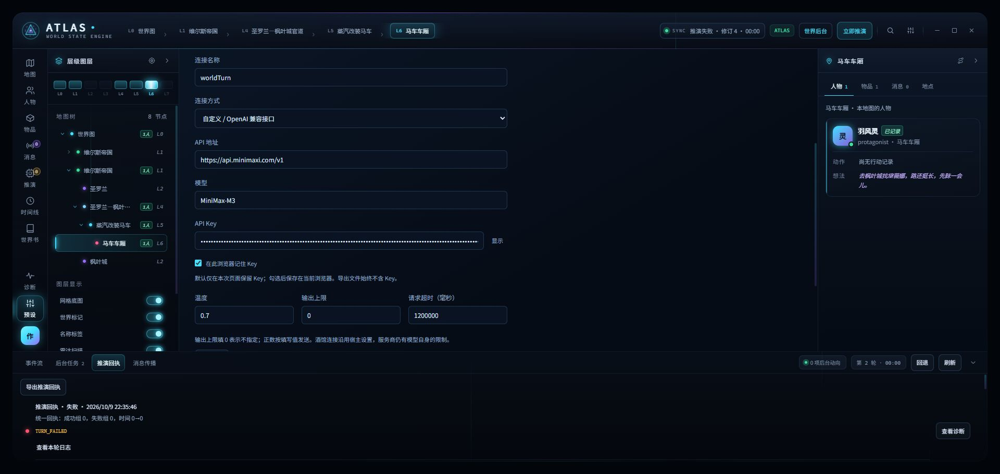
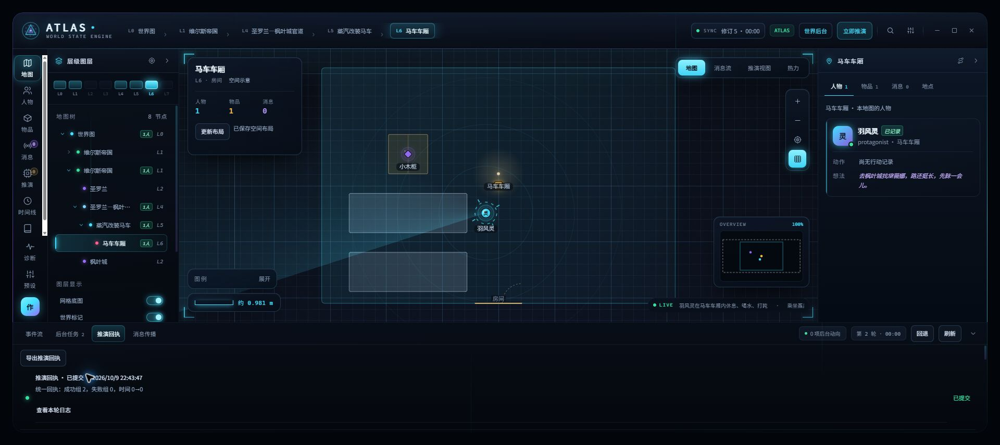

# 脚本网关与输出长度修复

日期：2026-10-09；版本：0.9.85 本地修复。

## shujuku 与脚本的实际链路

- 核对上游及本机安装的 shujuku：`pristine-fetch.ts` 只剥离自身已知包装标记，保留第三方 `fetch` 包装，并在发送时取得宿主当前的 `fetch`。
- shujuku 的酒馆代理请求进入 `/api/backends/chat-completions/generate`。普通响应读取 `message.content`；提供的 Kemini 脚本拦截该生成路由，将 `emit_complete_response_<随机24位hex>` 的 `content` 参数还原为正文。
- ATLAS 的自定义连接也进入酒馆代理，并动态调用宿主 `fetch`；当前酒馆连接经 `TavernHelper.generateRaw` 调用宿主生成。因此能够沿用该脚本链路。
- 新增兼容：收到尚未还原的 OpenAI `tool_calls` 时，只解析规定的正文载体或 ATLAS 自身声明的返回函数；不执行函数。未知函数、多函数、损坏参数和服务端长度截断继续报错。
- 此处的函数是回复传输格式；地图操作仍经过既有语义解析、校验、事务落库。

来源：

- [shujuku 的宿主 fetch 选择](https://github.com/AlbusKen/shujuku/blob/main/src/data/gateways/pristine-fetch.ts)
- [shujuku 的自定义 API 传输](https://github.com/AlbusKen/shujuku/blob/main/src/service/ai/custom-api-transport.ts)
- 用户提供的 `酒馆助手脚本-脚本3.json`，仅阅读分析；本次未安装或执行附件代码。

## 输出长度

- 移除 UI、设置保存及导入读取中的 65536 上限。
- 新连接默认 `maxTokens=0`；0 表示不指定，不发送 `max_tokens`。
- 正数按填写值发送，接受非负安全整数，262144 的保存、读取和发送均有覆盖。
- 移除 API 的 20000 默认值、酒馆连接预设的 1024 默认值及 SQL 阶段长度兜底。
- 保留明确的正数存档值；本机现有四套连接已通过界面设为 0 并保存。
- 酒馆当前连接仍沿用宿主生成设置；提供商的默认值、强制参数和模型长度限制不会因此消失。要求显式长度的接口可填写其接受的正数。

## 验证

- 新增 7 项测试：编辑器保存/导入、零值和大值传输、函数正文载体、非法响应、宿主连接、SQL 各阶段和 UI 默认值。
- 类型检查和构建打包通过；已更新本机酒馆安装目录。
- 完整回归 1852/1852 通过，0 失败；新增 7 项包含在完整回归内。

## 本机在线验收记录

- 地址 `http://localhost:8000`；仅使用已有独立验收聊天，正式剧情未操作。
- 页面加载完成时明确显示 `🛡 防截断 开`。
- 保存后的酒馆设置文件中，worldTurn、worldTurn 副本、gemini、酒馆连接验收 0.9.83 四套连接的 `maxTokens` 均为 0；原超时保留。
- 点击 ATLAS「立即推演」：initial、repair、construction、layout 四次模型请求均 HTTP 200；数据库修订 3→4。
- 回执：成功组 9、失败组 6。失败项是 `fixture` / `consumable` 非法类别与不存在的物品引用；此外本轮出现建设任务 deferred、未返回新布局约束等警告。证明传输与落库链路可用，不能据此宣称世界生成内容全部合格。
- 页面已还原回复；本次没有保存上游原始函数调用，不能断言这次模型实际选用了载体函数。未还原函数响应的兼容性由针对性测试覆盖。

## 追加：ATLAS 自定义 MiniMax 地图生成实测

前一项在线验收使用了酒馆当前连接，不能代替 ATLAS 自定义 MiniMax 的地图测试。本次按用户纠正重新核对：

- 测试入口：ATLAS 地图「更新布局」；地图初始化任务绑定 `worldTurn`，连接方式为自定义 OpenAI 兼容，模型 `MiniMax-M3`，输出长度 0。
- 未改酒馆当前模型、未改任务绑定、未启用 ATLAS 自身的函数输出选项。测试只操作独立验收聊天内已有的马车车厢地图。
- 第一次：22:32:52 发出请求，22:33:24 收到回复。Kemini 记录已追加传输控制提示，随后记录 `non-stream (本次请求没有开流式，且没找到传输函数调用)`。ATLAS 记录自定义 `model-proxy` 请求完成；布局操作第 3 行出现 JSON 语法错误，未落库。
- 第二次：22:35:29 发出请求，22:35:45 收到回复。Kemini 再次记录提示注入及同样的 `non-stream` 状态。ATLAS 诊断 `diag-mv12ie30-aj`：`MODEL_HTTP_COMPLETE`，`httpStatus=200`，`durationMs=16759`，`details={route:model-proxy,mode:custom}`。布局操作第 3 行依然有 JSON 语法错误，回执失败。
- 两次均保留原地图，数据库修订仍为 4；不能把界面上的旧地图当成本次生成成功。

**结论：ATLAS 内部 MiniMax 地图请求确实能经过现有脚本网关并得到响应。但这两次 MiniMax 未调用网关传输函数；防截断的函数正文传输未验证成功，地图更新也未通过内容校验。当前结论仅是请求链路通过。**

## 追加：ATLAS 自定义 Gemini 地图生成实测

- 使用已有 `gemini` API 预设：`gemini-3.7-flash-high`，自定义 OpenAI 兼容连接，输出长度 0，超时 30000 毫秒，ATLAS 自身函数输出选项关闭。
- 临时将「地图初始化」任务绑定到该预设，用 ATLAS 地图「更新布局」执行同一张马车车厢地图的生成任务，保留同一套提示词。
- 22:43:47 发出请求，22:44:04 返回。Kemini 日志明确记录：`anti-truncation: transported — 504 chars in 1 chunks`，证明模型调用了现有脚本网关的传输函数，正文已被还原。
- ATLAS 回执：`status=committed`、`coreSaved=true`；布局请求 HTTP 200，两组 applied、0 失败、issues 为空；地图 frame 和空间场景均更新。
- 已从酒馆测试聊天保存文件读回 SQL 快照：修订 4→5，最新回合 committed；马车车厢保存 floor 布局。正式聊天未操作。
- 测试后恢复原地图初始化任务绑定 `worldTurn`；Gemini 的模型、密钥、输出长度、超时及自身函数输出开关未修改。

**结论：这条 Gemini API 在 ATLAS 内部生成地图时，已实际经过现有脚本网关的函数正文传输，且地图布局成功校验、落库、显示。此结论针对本次布局任务，不能推及所有模型或全部世界建设阶段。**

